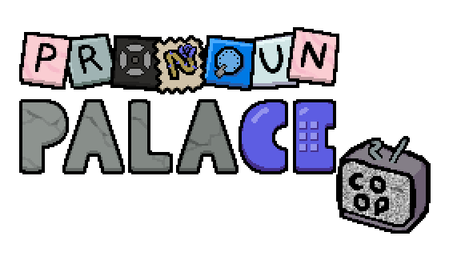

# Pronoun Palace Co-Op

### Stop back seating your friends, and get in on the action youself!

Features:

  * Online multiplayer
  * Steam multiplayer and matchmaking
  * New gift for co-op spells
  * 8 new multiplayer spells
  * Custom final boss fight

# Send Love Letters

 

# Commit Identity Theft

 

# Died before the end?

It's ok, you'll get a board of candy tiles and, so long as the other players beat the enemy, you'll be brought back, healed for the best healed for whatever healing you managed to get with your candy tiles in the meantime.
 
 
 
 
 
 
 
 
 
 
 
 
 
 
 
 
 
 
 
 
 
 
 
 
 
 
 
 
 
 
 
 
 
 

michivous developer may join your public lobies and steal your things >:3 be warned
